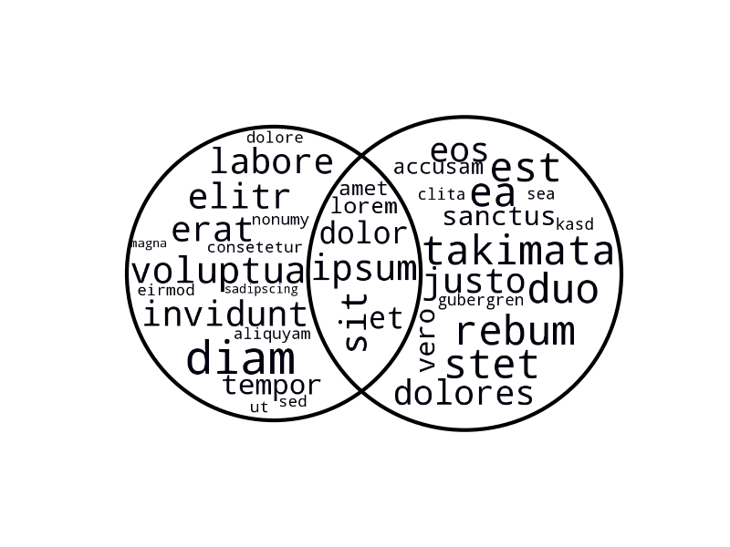

# venn_wordcloud

Plot a Venn diagram based on two sets of words.
The words are plotted as a word cloud on top.



Depends on [matplotlib-venn](https://github.com/konstantint/matplotlib-venn)
and [wordcoud](https://github.com/amueller/word_cloud) and their dependencies for the heavy lifting.

## Example

``` python
import venn_wordcloud

test_string_1 = "Lorem ipsum dolor sit amet, consetetur sadipscing elitr, sed diam nonumy eirmod tempor invidunt ut labore et dolore magna aliquyam erat, sed diam voluptua."

test_string_2 = " At vero eos et accusam et justo duo dolores et ea rebum. Stet clita kasd gubergren, no sea takimata sanctus est Lorem ipsum dolor sit amet."

sets = []

for string in [test_string_1, test_string_2]:
    # convert to all lower case
    string = string.lower()

    # get a word list
    words = string.split(' ')

    # remove non alphanumeric characters
    words = [''.join(ch for ch in word if ch.isalnum()) for word in words]

    sets.append(set(words))

venn_wordcloud.venn2_wordcloud(sets)
```
